# EXPLICACIÓ DELS PROCESSOS

## PAS 1️⃣:  Configuració prèvia
#### En primer lloc, hem creat i configurat tant els equips com les xarxes per obtenir una configuració òptima pel git.
#### DESKTOP 1
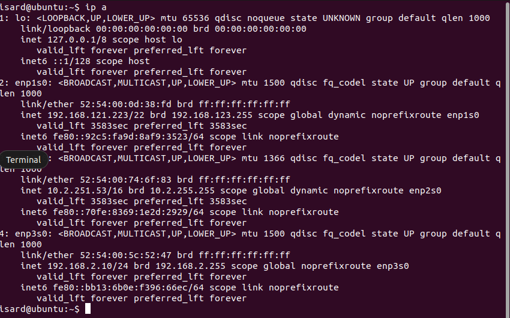
#### DESKTOP 2
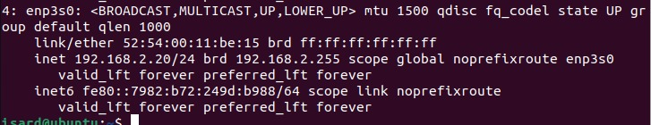
#### SERVER BDD
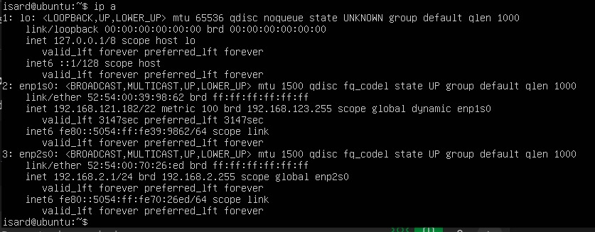
#### SERVER APACHE
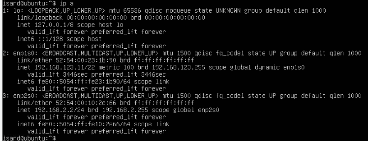
## PAS 2️⃣: Clonació del repositori als desktops
#### En segon lloc, hem comprovat l'acces per ssh al git.
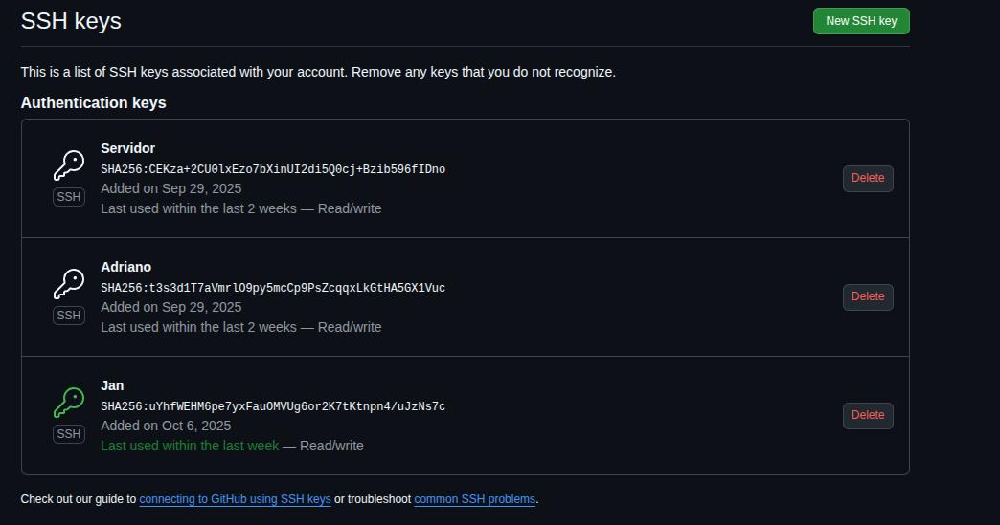

#### Despres hem clonat els repositoris del git als desktops
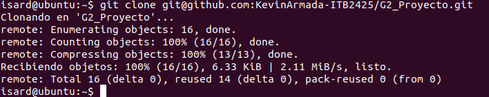

## PAS 3️⃣: Configuracion Server BDD
#### Instalacion de paquetes
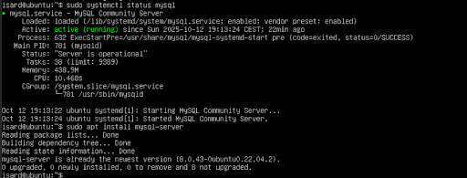
#### la BaseDeDatos i Tablas
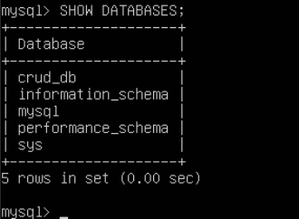
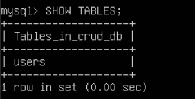
#### UserWeb
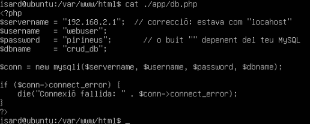
## PAS 4️⃣: Configuracion Server web 
#### en esta parte creamos el diseño de la web i conectamos el server web con el de BDD
#### instalacion de paquetes
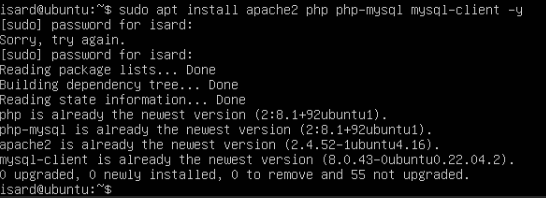
#### conectarse al server BDD
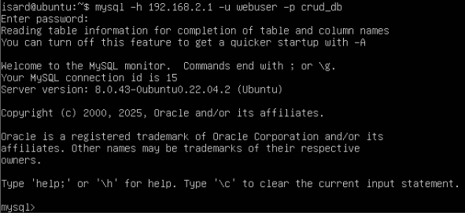
#### configurar la web
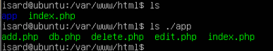
#### como el ciente entra a la web
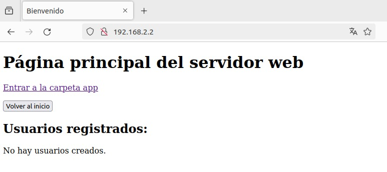
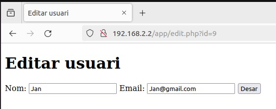
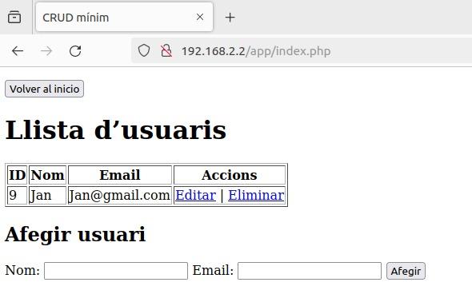
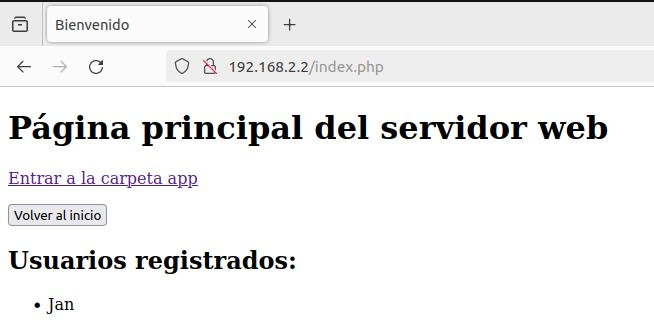
